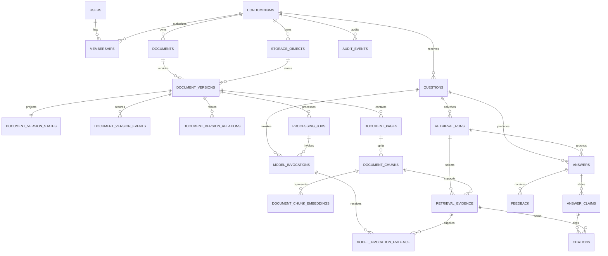

# Estrutura de banco de dados — consulta documental

**Status:** proposta para a Spec 001  
**Atualizado em:** 2026-08-31  
**Decisão relacionada:** `docs/adr/0005-postgresql-pgvector.md`

## 1. Escopo e alinhamento

Este desenho detalha somente a primeira fatia vertical de `docs/specs/001-consulta-documental/`. Ele materializa:

- o problema de consulta com evidência do briefing, §§ 4, 10, 11 e 21;
- versão, vigência e procedência, §§ 9, 10 e 12;
- isolamento, trilha, LGPD e abstenção segura, §§ 12, 14 e 15;
- medição de custo por resposta e condomínio, §§ 1, 15 e 16;
- os requisitos RQ-001 a RQ-014 e os critérios AC-001 a AC-021 da Spec 001.

Não adiciona obrigações, comunicados, fornecedores, ocorrências, painel multi-condomínio ou ações externas. Essas capacidades exigem specs próprias depois da validação da consulta documental.

## 2. Princípios do modelo

1. `condominium_id` é a fronteira de tenant, não apenas um campo de filtro.
2. Relações entre dados do cliente repetem o tenant e usam foreign keys compostas.
3. O arquivo original é imutável e fica em storage privado; o banco guarda uma chave opaca, nunca URL pública permanente.
4. Versões de arquivo são imutáveis. Estado operacional e vigência ficam em uma projeção separada com eventos auditáveis.
5. Chunks do MVP nunca cruzam a fronteira de uma página, simplificando citação e verificação de offsets.
6. Uma afirmação sobre o condomínio é uma entidade explícita e deve apontar para evidência quando `evidence_required = true`.
7. Feedback, eventos de versão e auditoria são append-only no fluxo normal.
8. Conteúdo não é duplicado em logs ou telemetria; IDs, hashes, versões e métricas são preferidos.
9. Exclusão é um fluxo privilegiado e verificável. Foreign keys usam `RESTRICT` por padrão para evitar cascatas acidentais.
10. Cache não é fonte de verdade e fica fora deste esquema. Qualquer implementação deve incluir tenant, permissões, versões e pipeline na chave.

## 3. Visão das relações



## 4. Convenções físicas

- nomes de tabelas e colunas: `snake_case` em inglês;
- IDs: UUID gerado pela aplicação, preferencialmente UUIDv7;
- tempo: `timestamptz` em UTC;
- tabelas de tenant: `PRIMARY KEY (condominium_id, id)`;
- tabelas de junção sem ciclo de vida próprio: chave natural composta iniciada por `condominium_id`;
- estados: `text` com `CHECK`, evitando enums de banco difíceis de evoluir;
- dinheiro de IA: inteiro em milionésimos da moeda, acompanhado por ISO 4217;
- scores: `double precision` quando são medidas de ranking; `numeric(5,4)` quando representam qualidade limitada a 0–1;
- metadados `jsonb`: somente campos esparsos, versionados e allowlisted; nunca substituem relações ou autorização;
- todo índice de tabela de tenant começa por `condominium_id`, salvo justificativa medida e revisada.

`condominiums` é a raiz e usa `id` como tenant. `users` é global e contém apenas a identidade mínima necessária. Essas são as exceções explícitas à coluna `condominium_id`.

## 5. Tabelas de identidade e acesso

### `users`

Identidade global mínima. Perfil, e-mail e credenciais permanecem no provedor de identidade quando possível.

| Coluna | Tipo | Regra |
|---|---|---|
| `id` | `uuid` | PK |
| `auth_subject` | `text` | único, opaco, nunca reutilizado |
| `status` | `text` | `active`, `blocked` ou `deleted` |
| `created_at` | `timestamptz` | obrigatório |
| `updated_at` | `timestamptz` | obrigatório |

### `condominiums`

Raiz de isolamento.

| Coluna | Tipo | Regra |
|---|---|---|
| `id` | `uuid` | PK e valor usado como `condominium_id` nos filhos |
| `display_name` | `text` | obrigatório |
| `status` | `text` | `active`, `suspended` ou `pending_deletion` |
| `created_at` | `timestamptz` | obrigatório |
| `updated_at` | `timestamptz` | obrigatório |

### `memberships`

Associação vigente usada para resolver `AuthorizedCondominiumContext`.

| Coluna | Tipo | Regra |
|---|---|---|
| `condominium_id`, `id` | `uuid`, `uuid` | PK composta |
| `user_id` | `uuid` | FK para `users` |
| `role_key` | `text` | papel aprovado pela futura decisão de identidade |
| `status` | `text` | `active`, `revoked` ou `expired` |
| `valid_from`, `valid_until` | `timestamptz` | intervalo; fim opcional |
| `revoked_at` | `timestamptz` | obrigatório quando revogada |
| `created_by_user_id` | `uuid` | ator que concedeu o acesso |
| `created_at`, `updated_at` | `timestamptz` | obrigatórios |

Constraints principais:

- índice único parcial em `(condominium_id, user_id)` somente para a associação ativa;
- intervalo de vigência consistente;
- associação revogada ou expirada nunca autoriza nova transação.

Uma concessão posterior cria outra linha, preservando a associação revogada como histórico. O evento correspondente também entra em `audit_events`.

Permissões detalhadas não serão armazenadas em JSON. Até a definição de papéis, a aplicação deriva uma allowlist versionada de `role_key`; uma futura necessidade de exceções cria `membership_permissions` por spec própria.

## 6. Tabelas de documentos e processamento

### `storage_objects`

Inventário de artefatos privados para upload, exportação e purge.

Campos: chave composta, `object_kind`, `storage_key`, `content_sha256`, `size_bytes`, `media_type`, `created_by_user_id`, `created_at`, `purge_status` e `purged_at`.

Regras:

- `UNIQUE (condominium_id, storage_key)`;
- `storage_key` é criada pelo servidor a partir do tenant e de um ID, nunca recebida livremente do cliente ou da mensagem do job;
- `content_sha256` detecta duplicidade, mas não é único, pois o mesmo arquivo pode participar de registros lógicos diferentes.

### `documents`

Registro lógico, como convenção, regimento, ata ou contrato.

Campos: chave composta, `title`, `document_type`, `status`, `created_by_user_id`, `created_at`, `updated_at` e `archived_at`.

Tipos iniciais: `convention`, `internal_rules`, `meeting_minutes`, `contract` e `other`. Estado: `active` ou `archived`.

### `document_versions`

Snapshot imutável do arquivo e da procedência no momento do upload.

Campos: chave composta, `document_id`, `version_number`, `storage_object_id`, `content_sha256`, `media_type`, `size_bytes`, `source_kind`, `source_description`, `issued_by`, `uploaded_by_user_id` e `created_at`.

Constraints principais:

- `UNIQUE (condominium_id, document_id, version_number)`;
- FKs compostas para `documents` e `storage_objects`;
- hash, objeto, documento e número da versão não são atualizáveis pelo runtime.

### `document_version_states`

Projeção atual, separada do snapshot imutável.

Campos: `condominium_id`, `document_version_id`, `processing_status`, `validity_status`, `valid_from`, `valid_until`, `ocr_quality_score`, `current_processing_job_id`, `last_event_id` e `updated_at`.

Estados de processamento: `uploaded`, `processing`, `ready`, `needs_review` ou `failed`. Estados de vigência: `pending`, `confirmed`, `disputed`, `superseded` ou `not_applicable`.

Toda mudança ocorre na mesma transação que insere um `document_version_event`. A versão nova nasce com vigência `pending`; upload ou número maior não a confirma automaticamente.

### `document_version_events`

Histórico append-only de upload, processamento, revisão, confirmação de vigência, falha e arquivamento.

Campos: chave composta, `document_version_id`, `event_type`, `actor_type`, `actor_user_id`, `from_state`, `to_state`, `metadata` sanitizado e `created_at`.

### `document_version_relations`

Relações explícitas e auditáveis entre versões.

Campos: chave composta, `source_version_id`, `target_version_id`, `relation_type`, `scope_note`, `confirmation_status`, `asserted_by_user_id` e `created_at`.

`relation_type` começa com `supersedes`, `amends`, `revokes` e `duplicates`. A direção significa “source relaciona-se com target”. `scope_note` descreve retificação parcial sem resolver prioridade silenciosamente. Relações não confirmadas não removem versões da recuperação; apenas produzem sinal de possível conflito.

### `processing_jobs`

Fonte transacional para extração, OCR, chunking e embeddings.

Campos: chave composta, `document_version_id`, `job_type`, `status`, `attempt_count`, `max_attempts`, `idempotency_key`, `available_at`, `leased_at`, `lease_expires_at`, `finished_at`, `error_code`, `error_metadata` sanitizado, `created_at` e `updated_at`.

O worker reivindica jobs com lock transacional e `SKIP LOCKED`, revalida a FK composta e opera em uma transação escopada ao tenant. Mensagens ou jobs nunca fornecem um path de storage arbitrário.

### `document_pages`

Texto verificável por página.

Campos: chave composta, `document_version_id`, `page_index` zero-based, `page_number` humano e one-based, `printed_label` opcional, `extracted_text`, `extraction_method`, `quality_score`, `content_sha256` e `created_at`.

Constraints principais:

- `UNIQUE (condominium_id, document_version_id, page_index)`;
- `page_index >= 0`, `page_number >= 1` e score entre 0 e 1;
- uma citação sempre usa `page_number`; `page_index` é apenas interno.

### `document_chunks`

Unidade de recuperação delimitada a uma página.

Campos: chave composta, `document_version_id`, `document_page_id`, `chunk_index`, `start_offset`, `end_offset`, `content`, `content_sha256`, `token_count`, `search_vector` e `created_at`.

Constraints principais:

- `UNIQUE (condominium_id, document_version_id, chunk_index)`;
- FK `(condominium_id, document_version_id, document_page_id)` garante que a página pertence à mesma versão repetida no chunk;
- offsets válidos dentro de `document_pages.extracted_text`;
- `content` deve corresponder ao intervalo da página; teste determinístico verifica essa identidade;
- `search_vector` é `tsvector` derivado com configuração para português e índice GIN, sempre consultado junto do filtro explícito e do RLS do tenant.

### `document_chunk_embeddings`

Representação semântica versionada separadamente do chunk.

Campos: chave composta, `document_chunk_id`, `embedding_profile`, `provider_key`, `model_key`, `model_version`, `pipeline_version`, `dimensions`, `embedding vector`, `content_sha256` e `created_at`.

Constraint única por tenant, chunk e perfil técnico. O hash precisa ser igual ao do chunk que foi embeddado. Perfis com dimensões diferentes podem coexistir; qualquer índice futuro é parcial por perfil e dimensão.

## 7. Tabelas de consulta, evidência e resposta

### `questions`

Campos: chave composta, `asked_by_user_id`, `content`, `language`, `idempotency_key`, `request_id`, `created_at` e `retention_until`.

A pergunta é dado confidencial do condomínio. Telemetria usa `id`, contagens ou hash, nunca uma cópia de `content`.

### `retrieval_runs`

Uma tentativa versionada de recuperação.

Campos: chave composta, `question_id`, `status`, `pipeline_version`, `risk_class`, `query_hash`, `started_at`, `finished_at`, `candidate_count`, `selected_count` e `failure_code`.

### `retrieval_evidence`

Candidato recuperado e, quando marcado, contexto permitido para geração.

Campos: chave composta, `retrieval_run_id`, `document_chunk_id`, `rank`, `lexical_score`, `semantic_score`, `rerank_score`, `selected_for_generation`, `sufficiency_flags` e `created_at`.

Constraint única por run e chunk. Evidência só referencia chunks do mesmo tenant. O conjunto com `selected_for_generation = true` é a allowlist para citações e para o gateway de IA.

### `answers`

Resultado estruturado e imutável depois de finalizado.

Campos: chave composta, `question_id`, `retrieval_run_id`, `schema_version`, `answer_mode`, `direct_answer`, `attention_points jsonb`, `suggested_next_step`, `specialist_required`, `specialist_type`, `specialist_reason`, `abstention_reason`, `validation_status`, `created_at` e `retention_until`.

`answer_mode`: `grounded`, `abstained`, `conflict` ou `failed`. `validation_status` precisa ser `passed` para exibir uma resposta fundamentada. O JSON de pontos de atenção é validado por schema e contém apenas uma lista ordenada de strings.

### `answer_claims`

Afirmações verificáveis da resposta.

Campos: chave composta, `answer_id`, `ordinal`, `statement`, `claim_type` e `evidence_required`.

`claim_type`: `condominium_fact`, `interpretation` ou `recommendation`. Fatos do condomínio sempre exigem evidência. Interpretações que dependem dos documentos também exigem evidência; recomendações podem não exigir, mas devem permanecer rotuladas.

### `citations`

Vínculo entre afirmação e evidência exibida.

Campos: chave composta, `answer_claim_id`, `retrieval_evidence_id`, `ordinal`, `document_title_snapshot`, `page_number_snapshot`, `page_start_offset`, `page_end_offset`, `excerpt_snapshot`, `excerpt_sha256` e `created_at`.

Antes do insert, a aplicação e uma constraint/função de banco validam que:

- a evidência estava selecionada para a mesma resposta e tenant;
- o chunk, a página, a versão e o documento existem;
- o trecho corresponde aos offsets da página e ao hash informado;
- toda claim com `evidence_required = true` possui ao menos uma citação antes de `answers.validation_status = passed`.

O snapshot preserva exatamente o que o usuário viu sem copiar páginas inteiras.

### `feedback`

Evento imutável de avaliação.

Campos: chave composta, `answer_id`, `submitted_by_user_id`, `classification`, `comment`, `created_at` e `retention_until`.

Classificações: `correct`, `incorrect`, `incomplete` ou `outdated`. Um novo feedback cria outra linha; nunca altera resposta, citação ou avaliação anterior.

## 8. Tabelas de IA, custo e auditoria

### `model_invocations`

Telemetria minimizada de cada chamada, inclusive falhas.

Campos: chave composta, `processing_job_id` opcional, `question_id` opcional, `answer_id` opcional, `retrieval_run_id` opcional, `task_type`, `risk_class`, `provider_key`, `model_key`, `model_version`, `prompt_version`, `pipeline_version`, `routing_reason`, `status`, `input_tokens`, `output_tokens`, `cached_input_tokens`, `latency_ms`, `estimated_cost_microunits`, `cost_currency`, `input_hash`, `output_hash`, `error_code` e `created_at`.

Uma invocação pertence a um job de processamento ou a uma pergunta. Links de resposta e retrieval só são permitidos quando a pergunta correspondente está presente e consistente.

Não armazena prompt renderizado, chave de API nem resposta bruta duplicada. Valores financeiros usam milionésimos da moeda para representar frações de centavo sem ponto flutuante.

### `model_invocation_evidence`

Junção entre uma invocação e a allowlist exata de evidências enviadas ao modelo.

Chave primária: `(condominium_id, model_invocation_id, retrieval_evidence_id)`. Pode incluir `ordinal` para reconstruir a ordem, mas não duplica o texto.

### `audit_events`

Trilha append-only de ações de domínio e segurança.

Campos: chave composta, `actor_type`, `actor_user_id`, `event_type`, `subject_type`, `subject_id`, `request_id`, `correlation_id`, `metadata` sanitizado, `created_at` e `retention_until`.

`subject_type` e `metadata` usam allowlists versionadas. Perguntas, respostas, documentos e trechos não são copiados para `metadata`.

## 9. Isolamento e autorização no PostgreSQL

### Chaves compostas

Toda tabela de tenant segue o padrão:

```sql
PRIMARY KEY (condominium_id, id)
```

Toda relação interna repete o tenant:

```sql
FOREIGN KEY (condominium_id, document_id)
  REFERENCES documents (condominium_id, id)
  ON DELETE RESTRICT
```

Assim, um `document_version` de Alameda não consegue referenciar um `document` de Bosque mesmo que a aplicação possua ambos os UUIDs.

Quando uma tabela repete mais de um nível da hierarquia, a FK também inclui esses ancestrais. Isso impede, por exemplo, um chunk de declarar a versão A e apontar para uma página da versão B dentro do mesmo condomínio, ou uma resposta de usar um retrieval criado para outra pergunta.

### RLS

Em todas as tabelas de tenant:

```sql
ALTER TABLE <table> ENABLE ROW LEVEL SECURITY;
ALTER TABLE <table> FORCE ROW LEVEL SECURITY;
```

O runtime de usuário recebe políticas `USING` e `WITH CHECK` que exigem:

1. `condominium_id` igual ao contexto transacional;
2. identidade do contexto igual ao ator autenticado;
3. membership ativa e dentro da vigência;
4. permissão para a operação quando aplicável.

O runtime, o worker e a migração usam papéis separados. Runtime e worker não são donos das tabelas e não possuem `BYPASSRLS`. O runtime fixa `app.user_id` e `app.condominium_id` com `SET LOCAL` antes do caso de uso; ausência do tenant selecionado falha fechado. A seleção valida o condomínio no contexto autorizado antes de abrir a transação de dados. O worker só recebe privilégios de processamento e sempre ativa um único tenant a partir de um job já persistido. Queries administrativas e purge usam papéis dedicados, autenticação reforçada e auditoria.

A consulta de membership usada pelas policies deve ficar em uma função mínima `SECURITY DEFINER`, pertencente a um papel `NOLOGIN`, com `search_path` fixo, sem SQL dinâmico e com permissão de execução restrita. Isso evita recursão de RLS sem transformar a função em uma API genérica de leitura.

`condominiums` recebe política sobre `id = active_condominium_id`. `memberships` também exige o tenant ativo. `users` possui política própria para a identidade atual e não é consultada como tabela de conteúdo de tenant.

### Contexto transacional

O servidor resolve o contexto antes de abrir o caso de uso. IDs enviados pelo cliente nunca configuram o banco diretamente. A transação fixa ator, tenant e versão de permissões; operações falham se o contexto estiver ausente. Revogação é revalidada a cada nova transação, e jobs não herdam uma sessão de usuário antiga.

## 10. Busca híbrida inicial

O retrieval segue três etapas:

1. filtrar por RLS, `condominium_id`, permissão, `ready`, vigência e qualidade mínima;
2. executar busca textual e distância vetorial exata apenas sobre esse conjunto materializado;
3. combinar rankings e reranquear somente evidências autorizadas.

Índices iniciais:

- B-tree nas FKs e nos filtros que começam por tenant;
- `(condominium_id, processing_status, validity_status)` na projeção de versões;
- GIN em `document_chunks.search_vector`;
- `(condominium_id, embedding_profile, document_chunk_id)` nos embeddings;
- nenhum HNSW/IVFFlat no piloto.

O GIN textual é a exceção inicial à regra de tenant como primeira coluna, pois indexa lexemas. RLS e o predicado explícito continuam obrigatórios, e os resultados textuais só entram no ranking após a materialização do conjunto autorizado.

Busca vetorial aproximada só será adicionada se corpus e latência justificarem. A nova decisão deve medir recall por tenant, impedir índice aproximado compartilhado que ranqueie antes do filtro e repetir AC-008/AC-009 com frases-canário.

## 11. Integridade de fluxos críticos

### Finalização de documento

Um documento só muda para `ready` na mesma transação que confirma páginas, chunks, embeddings obrigatórios e evento de estado. Falha deixa a versão em `failed` ou `needs_review`; nunca publica um conjunto parcial como pronto.

### Finalização de resposta

Pergunta, run e telemetria podem registrar falha. Uma resposta `grounded` ou `conflict` só passa para `validation_status = passed` se todas as claims obrigatórias tiverem citações válidas pertencentes à allowlist do mesmo retrieval. A interface só exibe o resultado finalizado.

### Append-only

Papéis de runtime não recebem `UPDATE` ou `DELETE` em `document_version_events`, `feedback` e `audit_events`. Correção cria evento novo. Purge por LGPD usa papel separado e deixa somente um comprovante minimizado sem conteúdo do cliente, conforme política de retenção ainda a aprovar.

## 12. Exportação, retenção e exclusão

Todas as tabelas e objetos derivados são enumeráveis por `condominium_id`. O fluxo de exclusão deve:

1. bloquear novas escritas e jobs;
2. inventariar linhas, objetos, caches e backups aplicáveis;
3. remover objetos privados;
4. remover dados derivados e transacionais em ordem explícita;
5. verificar contagem zero por tenant;
6. manter apenas recibo técnico minimizado permitido pela política.

Não se usa soft delete como substituto de purge. Os prazos de `retention_until`, backup e recibo precisam ser aprovados em T003 antes do piloto.

## 13. Ordem de implementação futura

Este documento não autoriza iniciar migrations antes de T001–T004. Depois desses gates:

1. extensões, papéis e helpers de contexto;
2. `users`, `condominiums`, `memberships` e testes AC-001–003;
3. documentos, estado, eventos, jobs, páginas e chunks;
4. embeddings e retrieval exato com canários AC-008/009;
5. perguntas, evidências, respostas, claims e citações;
6. feedback, custo, auditoria, exportação e purge;
7. testes de migration, RLS, revogação concorrente e restore.

O primeiro migration draft deve incluir apenas identidade e isolamento, mantendo a menor fatia vertical revisável.
